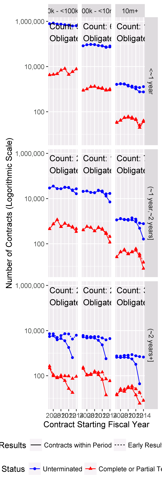

# ContractTermination
Greg Sanders  
Friday, March 20, 2015  

Is Terminated exploration
============================================================================


```r
setwd("K:\\Development\\Defense")

Path<-"K:\\2007-01 PROFESSIONAL SERVICES\\R scripts and data\\"
source(paste(Path,"lookups.r",sep=""))
```

```
## Loading required package: stringr
```

```
## Loading required package: plyr
```

```r
source(paste(Path,"helper.r",sep=""))
```

```
## Loading required package: ggplot2
```

```
## Loading required package: grid
```

```
## Loading required package: scales
```

```
## Loading required package: reshape2
```

```
## Loading required package: lubridate
```

```
## 
## Attaching package: 'lubridate'
```

```
## The following object is masked from 'package:plyr':
## 
##     here
```

```
## The following object is masked from 'package:base':
## 
##     date
```

```r
source("ContractCleanup.r")

require(ggplot2)
require(scales)
require(Hmisc)
```

```
## Loading required package: Hmisc
```

```
## Loading required package: lattice
```

```
## Loading required package: survival
```

```
## Loading required package: Formula
```

```
## 
## Attaching package: 'Hmisc'
```

```
## The following object is masked _by_ '.GlobalEnv':
## 
##     subplot
```

```
## The following objects are masked from 'package:plyr':
## 
##     is.discrete, summarize
```

```
## The following objects are masked from 'package:base':
## 
##     format.pval, round.POSIXt, trunc.POSIXt, units
```

```r
Coloration<-read.csv(
    paste(Path,"Lookups\\","lookup_coloration.csv",sep=""),
    header=TRUE, sep=",", na.strings="", dec=".", strip.white=TRUE, 
    stringsAsFactors=FALSE
    )

Coloration<-ddply(Coloration
                  , c(.(R), .(G), .(B))
                  , transform
                  , ColorRGB=as.character(
                      if(min(is.na(c(R,G,B)))) {NA} 
                      else {rgb(max(R),max(G),max(B),max=255)}
                      )
                  )
```

Contracts are classified using a mix of numerical and categorical variables. While the changes in numerical variables are easy to grasp and summarize, a contract may have one line item that is competed and another that is not. As is detailed in the exploration on R&D, we are only considering information available prior to contract start. The percentage of contract obligations that were competed is a valuable benchmark, but is highly influenced by factors that occured after contract start..

## Contract Terminations


Contract terminations and the number of change orders can be calculated for the entire sample.  Contract termination is determined using the *Reason for Modification* field in FPDS.  A contract is considered to be terminated if it has at least one modification with the following values:

* "Terminate for Default (complete or partial)"
* "Terminate for Convenience (complete or partial)"
* "Terminate for Cause"
* "Legal Contract Cancellation"

These four catetegories and the "Close Out" category are used to mark a contract as closed.  Many contracts in FPDS and in the sample are never marked closed.  


```r
CompleteModelAndDetail  <- read.csv(
    paste("LargeDatasets\\defense_contract_CSIScontractID_detail.csv", sep = ""),
    header = TRUE, sep = ",", dec = ".", strip.white = TRUE, 
    na.strings = c("NULL","NA",""),
    stringsAsFactors = TRUE
    )


CompleteModelAndDetail<-FormatContractModel(CompleteModelAndDetail)

#ContractWeighted <- apply_lookups(Path,ContractWeighted)


CompleteModelAndDetail$TermNum<-as.integer(as.character(factor(CompleteModelAndDetail$Term,
                                  levels=c("Terminated","Unterminated"),
                                  labels=c(1,0))))

CompleteModelAndDetail$ObligationWT<-CompleteModelAndDetail$Action.Obligation
CompleteModelAndDetail$ObligationWT[CompleteModelAndDetail$ObligationWT<0]<-NA

CompleteModelAndDetail<-ddply(CompleteModelAndDetail,
                         .(Ceil),
                         
                         plyr::mutate,
                         ceil.median.wt = median(UnmodifiedContractBaseAndAllOptionsValue)
)


CompleteModelAndDetail$UnmodifiedYearsFloat<-CompleteModelAndDetail$UnmodifiedDays/365.25
CompleteModelAndDetail$UnmodifiedYearsCat<-floor(CompleteModelAndDetail$UnmodifiedYearsFloat)
CompleteModelAndDetail$Dur[CompleteModelAndDetail$UnmodifiedYearsCat<0]<-NA

CompleteModelAndDetail$Dur.Simple<-as.character(CompleteModelAndDetail$Dur)
CompleteModelAndDetail$Dur.Simple[CompleteModelAndDetail$Dur.Simple %in% c(
    "[0 months,~2 months)",
    "[~2 months,~7 months)",
    "[~7 months-~1 year]")]<-"<~1 year"
CompleteModelAndDetail$Dur.Simple<-factor(CompleteModelAndDetail$Dur.Simple,
                                          levels=c("<~1 year",
                                               "(~1 year,~2 years]",
                                               "(~2 years+]"),
                                   ordered=TRUE
                                   )

CompleteModelAndDetail$Ceil.Simple<-as.character(CompleteModelAndDetail$Ceil)

CompleteModelAndDetail$Ceil.Simple[CompleteModelAndDetail$Ceil.Simple %in% c(
    "75m+",
    "10m - <75m")]<-"10m+"
CompleteModelAndDetail$Ceil.Simple[CompleteModelAndDetail$Ceil.Simple %in% c(
    "1m - <10m",
    "100k - <1m")]<-"100k - <10m"
CompleteModelAndDetail$Ceil.Simple[CompleteModelAndDetail$Ceil.Simple %in% c(
    "15k - <100k",
    "0 - <15k")]<-"0k - <100k"
CompleteModelAndDetail$Ceil.Simple<-factor(CompleteModelAndDetail$Ceil.Simple,
       levels=c("0k - <100k",
                "100k - <10m",
                "10m+"),
       ordered=TRUE
       )


write.csv(subset(CompleteModelAndDetail,Term=="Terminated"),"Terminated.csv")
```

**A Histogram of the IsTerminated data** showing the distribution of whether or not a contract was terminated each year from 2007.  


```r
# TerminatedDurSummary<-ddply(subset(CompleteModelAndDetail,StartFiscalYear>=2007 & 
#                   !is.na(Ceil)&
#                   UnmodifiedCompletionDate<=as.Date("2015-09-30")&
#                       !is.na(Term)),
#                             .(Ceil,
#                               Dur,
#                               StartFiscalYear,
#                               Term
#                             ),
#                             plyr::summarise,
#                             Action.Obligation=sum(Action.Obligation),
#                             Count=length(CSIScontractID)
#                   )
# 
# 
# TerminatedDurSummary<-ddply(TerminatedDurSummary,.(Ceil,
#                                                   Dur,
#                                              StartFiscalYear
#                                              ),transform,
#                       pContractCeilDurStart=Count/sum(Count),
#                       pObligationCeilDurStart=Action.Obligation/sum(Action.Obligation)
#       )
# 
# 
# ggplot(TerminatedDurSummary,
#        aes(x=StartFiscalYear,
#            y=Count,
#            color=Term))+geom_line()+    geom_point(aes(shape=metric))+facet_grid(Ceil ~ Dur ) +scale_y_log10(labels=scales::comma)
# 
# 
# 
# 
# 
# 
# ggplot(
#   data = TerminatedEndSummary,
#   aes_string(x = "Term"),
#   ) + geom_bar() + 
#     facet_grid( Ceil ~ .,
#                 scales = "free_y",
#                 space = "free_y") + scale_y_continuous(expand = c(0,50)) 
# 
# 
# 
# 
# 
# ggplot(
#   data = subset(TerminatedEndSummary,Term=="Terminated"),
#   aes_string(x = "Ceil")
#   )+ geom_bar()+
#     scale_x_discrete("Original Ceiling (Current $ Value)")+scale_y_continuous("Number of Partially or Completely \nTerminated Contracts",labels = comma)+theme(axis.text.x=element_text(angle=90,size=12))
# 
# 
# 
# 
# 
# 
# TerminatedEndSummary$Graph[TerminatedEndSummary$Term=="Terminated"]<-TRUE
# 
# TerminatedEndSummary$Graph[TerminatedEndSummary$Term=="Unterminated"]<-FALSE
# 
# 
# head(TerminatedEndSummary)
# 
# ggplot(
#   data = subset(TerminatedEndSummary,Term=="Terminated"),
#   aes(x = Ceil,weight=Action.Obligation/1000000000)
#   )+ geom_bar()+
#     scale_x_discrete("Original Ceiling (Current $ Value)")+scale_y_continuous("Obligations to Partially or Completely\nTerminated Contracts (Current $ Billions)",labels = comma)+theme(axis.text.x=element_text(angle=90,size=12))
# 
# 
# ggplot(
#   data = subset(TerminatedEndSummary,Term=="Terminated"),
#   aes_string(x = "Ceil",weight="pContract")
# #   main="Percentage of Contracts going to Partially or Completely Terminated Contracts\nBy Initial Contract Ceiling"
#   )+ geom_bar()+ scale_y_continuous("Percent of Contracts Partially or Completely Terminated\nby Original Ceiling Category", labels=percent)+
#     scale_x_discrete("Original Ceiling (Current $ Value)")+theme(axis.text.x=element_text(angle=90,size=12))
# 
# 
# ggplot(
#   data = subset(TerminatedEndSummary,Term=="Terminated"),
#   aes_string(x = "Ceil",weight="pObligation"),
#   main="Percentage of Contract Obligations going to Partially or Completely Terminated Contracts\nBy Initial Contract Ceiling"
#   )+ geom_bar()+ scale_y_continuous("Percent of Obligations to Terminated Contracts \nin Original Ceiling Category", labels=percent)+
#     scale_x_discrete("Original Ceiling (Current $ Value)")+theme(axis.text.x=element_text(angle=90,size=12))
# 
# 
# # 
# # LatticePercentLineWrapper("VAR.name"
# #                                     ,"VAR.proper.name"
# #                                     ,"VAR.X.label"
# #                                     ,"VAR.Y.label"
# #                                     ,Coloration
# #                                     ,subset(TerminatedEndSummary,!is.na(Term))
# #                                     ,NULL
# #                                     ,"Ceil"
# #                                     ,"Count"
# #                                     ,"Term"
# #                                     ,NA
# #                                     ,NA
# #                                     )
# 
# # 
# # + 
# #     facet_grid( Ceil ~ .,
# #                 scales = "free_y",
# #                 space = "free_y") 
# # 

head(CompleteModelAndDetail)
```

```
##   CSIScontractID        FxCb           Fee     IDV     Comp       Who
## 1       61826716  Cost-Based FFP or No Fee Def/Pur No Comp. Air Force
## 2       25664189 Fixed-Price     Incentive     IDV No Comp. Air Force
## 3       62928714  Cost-Based     Fixed Fee Def/Pur    Comp.      Army
## 4        8318562 Fixed-Price FFP or No Fee Def/Pur    Comp.      Army
## 5        1380551 Fixed-Price FFP or No Fee Def/Pur    Comp. Air Force
## 6       61826653 Fixed-Price FFP or No Fee Def/Pur    Comp. Air Force
##                             What              Intl      PSR LowCeil Ceil
## 1 Electronics and Communications Any International      R&D  [30m+] 75m+
## 2            Aircraft and Drones         Just U.S. Products  [30m+] 75m+
## 3                          Other Any International Services  [30m+] 75m+
## 4    Facilities and Construction Any International Services  [30m+] 75m+
## 5    Facilities and Construction Any International Services  [30m+] 75m+
## 6         Weapons and Ammunition Any International Products  [30m+] 75m+
##           Dur SingleOffer Offr              Soft     UCA            CRai
## 1        <NA>      Single    1 Not Software Eng.    <NA> [-0.001, 0.001)
## 2 (~2 years+]      Single    1 Not Software Eng.     UCA [-0.001, 0.001)
## 3        <NA>       Multi   5+ Not Software Eng.    <NA> [-0.001, 0.001)
## 4        <NA>       Multi   5+ Not Software Eng. Not UCA [-0.001, 0.001)
## 5        <NA>       Multi   5+ Not Software Eng. Not UCA [-0.001, 0.001)
## 6        <NA>       Multi   5+ Not Software Eng.    <NA> [-0.001, 0.001)
##   NChg            Veh UnmodifiedNumberOfOffersReceived         Term
## 1    0           <NA>                                1 Unterminated
## 2    0      Other IDV                                1 Unterminated
## 3    0           <NA>                               10 Unterminated
## 4    0 MULTIPLE AWARD                               12 Unterminated
## 5    0 MULTIPLE AWARD                               13 Unterminated
## 6    0           <NA>                               22 Unterminated
##   UnmodifiedContractBaseAndAllOptionsValue SumOfisChangeOrder
## 1                               8340117466                  0
## 2                                126642474                  0
## 3                                496000000                  0
## 4                                100000000                  0
## 5                                 95000000                  0
## 6                                490000000                  0
##   pChangeOrderUnmodifiedBaseAndAll pChangeOrderObligated
## 1                                0                     0
## 2                                0                     0
## 3                                0                     0
## 4                                0                     0
## 5                                0                     0
## 6                                0                     0
##   pNewWorkUnmodifiedBaseAndAll pNewWorkObligated MinOfEffectiveDate
## 1                   0.00000000                NA         2015-04-28
## 2                   0.02813983        0.03767282         2012-11-05
## 3                   0.00000000        0.00000000         2015-05-21
## 4                   0.00000000        0.00000000         2012-05-08
## 5                   0.00000000                NA         2012-08-08
## 6                   0.00000000        0.00000000         2015-09-10
##   UnmodifiedCurrentCompletionDate LastCurrentCompletionDate    IsClosed
## 1                            <NA>                      <NA> Unspecified
## 2                      2014-12-31                2015-12-31 Unspecified
## 3                            <NA>                      <NA> Unspecified
## 4                            <NA>                      <NA> Unspecified
## 5                            <NA>                      <NA> Unspecified
## 6                            <NA>                      <NA> Unspecified
##   Action.Obligation ContractCount StartFiscalYear UnmodifiedDays TermNum
## 1                 0             1            2015             NA       0
## 2          94595994             1            2013            787       0
## 3                 0             1            2015             NA       0
## 4                 0             1            2012             NA       0
## 5                 0             1            2012             NA       0
## 6                 0             1            2015             NA       0
##   ObligationWT ceil.median.wt UnmodifiedYearsFloat UnmodifiedYearsCat
## 1            0       4.75e+08                   NA                 NA
## 2     94595994       4.75e+08             2.154689                  2
## 3            0       4.75e+08                   NA                 NA
## 4            0       4.75e+08                   NA                 NA
## 5            0       4.75e+08                   NA                 NA
## 6            0       4.75e+08                   NA                 NA
##    Dur.Simple Ceil.Simple
## 1        <NA>        10m+
## 2 (~2 years+]        10m+
## 3        <NA>        10m+
## 4        <NA>        10m+
## 5        <NA>        10m+
## 6        <NA>        10m+
```


```r
# 
# ggplot(TerminatedEndSummary,
#        aes(x=StartFiscalYear,
#            y=Count,
#            color=Term))+geom_line()+    geom_point(aes(shape=metric))+facet_grid(Ceil ~ EndAfterPeriod ) +scale_y_log10()
```


```r
# 
# TerminatedUnmodifiedYearsCatStat<-rbind(ddply(subset(CompleteModelAndDetail,
#                                 !is.na(Dur) & StartFiscalYear>=2007 & 
#                                     !is.na(UnmodifiedYearsCat) &
#                                     UnmodifiedCurrentCompletionDate<as.Date("2015-09-30")&
#                                     !is.na(Term)),
#                          .(UnmodifiedYearsCat,
#                            StartFiscalYear
#                          ),
#                          
#                          plyr::summarise,
#                          Action.Obligation=sum(Action.Obligation),
#                          Count=length(CSIScontractID),
#                          mean = mean(TermNum),
#                          sd   = NA ,# sd(TermNum),
#                          se   = NA, #sd / sqrt(Count),
#                          metric="Unweighted"
#                           # ceil.mean = wtd.mean(TermNum,UnmodifiedContractBaseAndAllOptionsValue),
#                          # ceil.cat.mean = wtd.mean(TermNum,ceil.median.wt)
# ))
# 
# 
# 
# TerminatedUnmodifiedYearsCatStat<-rbind(TerminatedUnmodifiedYearsCatStat,
#                          ddply(subset(CompleteModelAndDetail,
#                                 !is.na(Dur) & StartFiscalYear>=2007 & 
#                                     !is.na(Ceil) &
#                                     UnmodifiedCurrentCompletionDate<as.Date("2015-09-30")&
#                                     !is.na(Term)),
#                          .(UnmodifiedYearsCat,
#                            StartFiscalYear
#                          ),
#                          
#                          plyr::summarise,
#                          Action.Obligation=sum(Action.Obligation),
#                          Count=length(CSIScontractID),
#                          mean = wtd.mean(TermNum,ObligationWT),
#                          sd   = NA ,# sd(TermNum),
#                          se   = NA, #sd / sqrt(Count),
#                          metric="Obligation Weighted"
#                           # ceil.mean = wtd.mean(TermNum,UnmodifiedContractBaseAndAllOptionsValue),
#                          # ceil.cat.mean = wtd.mean(TermNum,ceil.median.wt)
# 
# ))
# 
# TerminatedUnmodifiedYearsCatStat<-rbind(TerminatedUnmodifiedYearsCatStat,
#                          ddply(subset(CompleteModelAndDetail,
#                                 !is.na(Dur) & StartFiscalYear>=2007 & 
#                                     !is.na(Ceil) &
#                                     UnmodifiedCurrentCompletionDate<as.Date("2015-09-30")&
#                                     !is.na(Term)),
#                          .(UnmodifiedYearsCat,
#                            StartFiscalYear
#                          ),
#                          
#                          plyr::summarise,
#                          Action.Obligation=sum(Action.Obligation),
#                          Count=length(CSIScontractID),
#                          mean = wtd.mean(TermNum,UnmodifiedContractBaseAndAllOptionsValue),
#                          sd   = NA ,# sd(TermNum),
#                          se   = NA, #sd / sqrt(Count),
#                          metric="Ceiling Weighted"
#                          # obl.mean = ,
#                          # ceil.mean = wtd.mean(TermNum,UnmodifiedContractBaseAndAllOptionsValue),
#                          # ceil.cat.mean = wtd.mean(TermNum,ceil.median.wt)
# 
# ))
# 
# 
# TerminatedUnmodifiedYearsCatStat<-rbind(TerminatedUnmodifiedYearsCatStat,
#                          ddply(subset(CompleteModelAndDetail,
#                                 !is.na(Dur) & StartFiscalYear>=2007 & 
#                                     !is.na(Ceil) &
#                                     UnmodifiedCurrentCompletionDate<as.Date("2015-09-30")&
#                                     !is.na(Term)),
#                          .(UnmodifiedYearsCat,
#                            StartFiscalYear
#                          ),
#                          
#                          plyr::summarise,
#                          Action.Obligation=sum(Action.Obligation),
#                          Count=length(CSIScontractID),
#                          mean = wtd.mean(TermNum,ceil.median.wt),
#                          sd   = NA ,# sd(TermNum),
#                          se   = NA, #sd / sqrt(Count),
#                          metric="Ceiling Category Weighted"
# 
# ))
# 
# 
# # 
# # pd <- position_dodge(0.1) # move them .05 to the left and right
# # 
# # ggplot(tgc, aes(x=dose, y=len, colour=supp)) + 
# #     geom_errorbar(aes(ymin=len-se, ymax=len+se), width=.1, position=pd) 
# 
# ggplot(TerminatedUnmodifiedYearsCatStat,aes(x=StartFiscalYear,y=mean,color=metric))+
#     geom_line()+
#         geom_point(aes(shape=metric))+
#     facet_grid(.~ UnmodifiedYearsCat ) +
#     scale_x_continuous("Contract Starting Fiscal Year")+
#     scale_y_continuous(label=percent)+
#     geom_errorbar(aes(ymin=mean-se, ymax=mean+se), width=.1)+
#     theme(legend.position="bottom") #, position=pd
```


```r
# 
# TerminatedDurStat<-rbind(                         ddply(subset(CompleteModelAndDetail,
#                                 !is.na(Dur) & StartFiscalYear>=2007 & 
#                                     StartFiscalYear<=2014 & 
#                                     !is.na(Ceil) &
#                                     UnmodifiedCurrentCompletionDate<as.Date("2015-09-30")&
#                                     !is.na(Term)),
#                          .(Dur,
#                            StartFiscalYear
#                          ),
#                          
#                          plyr::summarise,
#                          Action.Obligation=sum(Action.Obligation),
#                          Count=length(CSIScontractID),
#                          mean = mean(TermNum),
#                          sd   = sd(TermNum),
#                          se   = sd / sqrt(Count),
#                          metric="Unweighted"
#                           # ceil.mean = wtd.mean(TermNum,UnmodifiedContractBaseAndAllOptionsValue),
#                          # ceil.cat.mean = wtd.mean(TermNum,ceil.median.wt)
# ))
# 
# 
# TerminatedDurStat<-rbind(TerminatedDurStat,
#                          ddply(subset(CompleteModelAndDetail,
#                                 !is.na(Dur) & StartFiscalYear>=2007 & 
#                                     StartFiscalYear<=2014 & 
#                                     !is.na(Ceil) &
#                                     UnmodifiedCurrentCompletionDate<as.Date("2015-09-30")&
#                                     !is.na(Term)),
#                          .(Dur,
#                            StartFiscalYear
#                          ),
#                          
#                          plyr::summarise,
#                          Action.Obligation=sum(Action.Obligation),
#                          Count=length(CSIScontractID),
#                          mean = wtd.mean(TermNum,ObligationWT),
#                          sd   = sqrt(wtd.var(TermNum,ObligationWT)) ,
#                          se   = sd / sqrt(Count),
#                          metric="Obligation Weighted"
#                           # ceil.mean = wtd.mean(TermNum,UnmodifiedContractBaseAndAllOptionsValue),
#                          # ceil.cat.mean = wtd.mean(TermNum,ceil.median.wt)
# ))
# 
# TerminatedDurStat<-rbind(TerminatedDurStat,
#                          ddply(subset(CompleteModelAndDetail,
#                                 !is.na(Dur) & StartFiscalYear>=2007 & 
#                                     StartFiscalYear<=2014 & 
#                                     !is.na(Ceil) &
#                                     UnmodifiedCurrentCompletionDate<as.Date("2015-09-30")&
#                                     !is.na(Term)),
#                          .(Dur,
#                            StartFiscalYear
#                          ),
#                          
#                          plyr::summarise,
#                          Action.Obligation=sum(Action.Obligation),
#                          Count=length(CSIScontractID),
#                          mean = wtd.mean(TermNum,UnmodifiedContractBaseAndAllOptionsValue),
#                          sd   = sqrt(wtd.var(TermNum,UnmodifiedContractBaseAndAllOptionsValue)) ,
#                          se   = sd / sqrt(Count),
#                          metric="Ceiling Weighted"
#                          # obl.mean = ,
#                          # ceil.mean = wtd.mean(TermNum,UnmodifiedContractBaseAndAllOptionsValue),
#                          # ceil.cat.mean = wtd.mean(TermNum,ceil.median.wt)
# 
# ))
# 
# 
# TerminatedDurStat<-rbind(TerminatedDurStat,
#                          ddply(subset(CompleteModelAndDetail,
#                                 !is.na(Dur) & StartFiscalYear>=2007 & 
#                                     StartFiscalYear<=2014 & 
#                                     !is.na(Ceil) &
#                                     UnmodifiedCurrentCompletionDate<as.Date("2015-09-30")&
#                                     !is.na(Term)),
#                          .(Dur,
#                            StartFiscalYear
#                          ),
#                          
#                          plyr::summarise,
#                          Action.Obligation=sum(Action.Obligation),
#                          Count=length(CSIScontractID),
#                          mean = wtd.mean(TermNum,ceil.median.wt),
#                          sd   = sqrt(wtd.var(TermNum,ceil.median.wt)) ,
#                          se   = sd / sqrt(Count),
#                          metric="Ceiling Category Weighted"
# 
# ))
# 
# 
# # 
# # pd <- position_dodge(0.1) # move them .05 to the left and right
# # 
# # ggplot(tgc, aes(x=dose, y=len, colour=supp)) + 
# #     geom_errorbar(aes(ymin=len-se, ymax=len+se), width=.1, position=pd) 
# 
# ggplot(subset(TerminatedDurStat,!metric %in% c("Ceiling Weighted")),
#        aes(x=StartFiscalYear,y=mean,color=metric))+
#     geom_line()+
#         geom_point(aes(shape=metric))+
#     facet_grid( Dur  ~.) +
#     scale_x_continuous("Contract Starting Fiscal Year")+
#     scale_y_continuous(label=percent)+
#     geom_errorbar(aes(ymin=mean-se, ymax=mean+se), width=.1)+
#     theme(legend.position="bottom") #, position=pd
# 
# ggplot(subset(TerminatedDurStat,!metric %in% c("Ceiling Weighted","Ceiling Category Weighted")),
#        aes(x=StartFiscalYear,y=mean,color=metric))+
#     geom_line()+
#         geom_point(aes(shape=metric))+
#     facet_grid( Dur  ~., space = "free_y", scales="free_y") +
#     scale_x_continuous("Contract Starting Fiscal Year")+
#     scale_y_continuous(label=percent)+
#     geom_errorbar(aes(ymin=mean-se, ymax=mean+se), width=.1)+
#     theme(legend.position="bottom") #, position=pd
# 
# 
```


```r
# TerminatedDur.SimpleStatCount<-ddply(subset(CompleteModelAndDetail,
#                                 !is.na(Dur) & StartFiscalYear>=2007 & 
#                                     StartFiscalYear<=2014 & 
#                                     !is.na(Ceil) &
#                                     UnmodifiedCurrentCompletionDate<as.Date("2015-09-30")&
#                                     !is.na(Term)),
#                          .(Dur.Simple,
#                            StartFiscalYear,
#                            Term
#                          ),
#                          
#                          plyr::summarise,
#                          Action.Obligation=sum(Action.Obligation),
#                          Count=length(CSIScontractID)
# )
# 
# ggplot(TerminatedDur.SimpleStatCount,
#        aes(x=StartFiscalYear,y=Count,color=Term))+
#     geom_line()+
#     geom_point(aes(shape=Term))+
#     facet_grid( Dur.Simple  ~.) +
#     scale_x_continuous("Contract Starting Fiscal Year")+
#     scale_y_log10("Number of Contracts",label=comma)
#     geom_errorbar(aes(ymin=mean-se, ymax=mean+se), width=.1)+
#     # theme(legend.position="bottom") #, position=pd
# 
# ggplot(TerminatedDur.SimpleStatCount,
#        aes(x=StartFiscalYear,y=Count,color=Term))+
#     geom_line()+
#         geom_point(aes(shape=Term))+
#     facet_grid( Dur.Simple  ~., ) +#
#     scale_x_continuous("Contract Starting Fiscal Year")+
#         
#     scale_y_log10("Number of Contracts (Variable Scale)",label=comma)
#     # geom_errorbar(aes(ymin=mean-se, ymax=mean+se), width=.1)+
#     theme(legend.position="bottom") #, position=pd
#     
```


```r
# ddply(TerminatedDurStat,
#       .(Dur),
#       plyr::summarise,
#       Count=sum(Count),
#       Action.Obligation=sum(Action.Obligation))
# 
# 
# 
# TerminatedDur.SimpleStat<-rbind(                         ddply(subset(CompleteModelAndDetail,
#                                 !is.na(Dur) & StartFiscalYear>=2007 & 
#                                     StartFiscalYear<=2014 & 
#                                     !is.na(Ceil) &
#                                     UnmodifiedCurrentCompletionDate<as.Date("2015-09-30")&
#                                     !is.na(Term)),
#                          .(Dur.Simple,
#                            StartFiscalYear
#                          ),
#                          
#                          plyr::summarise,
#                          Action.Obligation=sum(Action.Obligation),
#                          Count=length(CSIScontractID),
#                          mean = mean(TermNum),
#                          sd   = sd(TermNum),
#                          se   = sd / sqrt(Count),
#                          metric="Unweighted"
#                           # ceil.mean = wtd.mean(TermNum,UnmodifiedContractBaseAndAllOptionsValue),
#                          # ceil.cat.mean = wtd.mean(TermNum,ceil.median.wt)
# ))
# 
# 
# TerminatedDur.SimpleStat<-rbind(TerminatedDur.SimpleStat,
#                          ddply(subset(CompleteModelAndDetail,
#                                 !is.na(Dur) & StartFiscalYear>=2007 & 
#                                     StartFiscalYear<=2014 & 
#                                     !is.na(Ceil) &
#                                     UnmodifiedCurrentCompletionDate<as.Date("2015-09-30")&
#                                     !is.na(Term)),
#                          .(Dur.Simple,
#                            StartFiscalYear
#                          ),
#                          
#                          plyr::summarise,
#                          Action.Obligation=sum(Action.Obligation),
#                          Count=length(CSIScontractID),
#                          mean = wtd.mean(TermNum,ObligationWT),
#                          sd   = sqrt(wtd.var(TermNum,ObligationWT)) ,
#                          se   = sd / sqrt(Count),
#                          metric="Obligation Weighted"
#                           # ceil.mean = wtd.mean(TermNum,UnmodifiedContractBaseAndAllOptionsValue),
#                          # ceil.cat.mean = wtd.mean(TermNum,ceil.median.wt)
# ))
# 
# TerminatedDur.SimpleStat<-rbind(TerminatedDur.SimpleStat,
#                          ddply(subset(CompleteModelAndDetail,
#                                 !is.na(Dur) & StartFiscalYear>=2007 & 
#                                     StartFiscalYear<=2014 & 
#                                     !is.na(Ceil) &
#                                     UnmodifiedCurrentCompletionDate<as.Date("2015-09-30")&
#                                     !is.na(Term)),
#                          .(Dur.Simple,
#                            StartFiscalYear
#                          ),
#                          
#                          plyr::summarise,
#                          Action.Obligation=sum(Action.Obligation),
#                          Count=length(CSIScontractID),
#                          mean = wtd.mean(TermNum,UnmodifiedContractBaseAndAllOptionsValue),
#                          sd   = sqrt(wtd.var(TermNum,UnmodifiedContractBaseAndAllOptionsValue)) ,
#                          se   = sd / sqrt(Count),
#                          metric="Ceiling Weighted"
#                          # obl.mean = ,
#                          # ceil.mean = wtd.mean(TermNum,UnmodifiedContractBaseAndAllOptionsValue),
#                          # ceil.cat.mean = wtd.mean(TermNum,ceil.median.wt)
# 
# ))
# 
# 
# TerminatedDur.SimpleStat<-rbind(TerminatedDur.SimpleStat,
#                          ddply(subset(CompleteModelAndDetail,
#                                 !is.na(Dur) & StartFiscalYear>=2007 & 
#                                     StartFiscalYear<=2014 & 
#                                     !is.na(Ceil) &
#                                     UnmodifiedCurrentCompletionDate<as.Date("2015-09-30")&
#                                     !is.na(Term)),
#                          .(Dur.Simple,
#                            StartFiscalYear
#                          ),
#                          
#                          plyr::summarise,
#                          Action.Obligation=sum(Action.Obligation),
#                          Count=length(CSIScontractID),
#                          mean = wtd.mean(TermNum,ceil.median.wt),
#                          sd   = sqrt(wtd.var(TermNum,ceil.median.wt)) ,
#                          se   = sd / sqrt(Count),
#                          metric="Ceiling Category Weighted"
# 
# ))
# 
# 
# # 
# # pd <- position_dodge(0.1) # move them .05 to the left and right
# # 
# # ggplot(tgc, aes(x=dose, y=len, colour=supp)) + 
# #     geom_errorbar(aes(ymin=len-se, ymax=len+se), width=.1, position=pd) 
# 
# ggplot(subset(TerminatedDur.SimpleStat,!metric %in% c("Ceiling Weighted","Ceiling Category Weighted")),
#        aes(x=StartFiscalYear,y=mean,color=metric))+
#     geom_line()+
#     geom_point(aes(shape=metric))+
#     facet_grid( Dur.Simple  ~.) +
#     scale_x_continuous("Contract Starting Fiscal Year")+
#     scale_y_continuous(label=percent)+
#     geom_errorbar(aes(ymin=mean-se, ymax=mean+se), width=.1)+
#     theme(legend.position="bottom") #, position=pd
# 
# ggplot(subset(TerminatedDur.SimpleStat,!metric %in% c("Ceiling Weighted","Ceiling Category Weighted")),
#        aes(x=StartFiscalYear,y=mean,color=metric))+
#     geom_line()+
#         geom_point(aes(shape=metric))+
#     facet_grid( Dur.Simple  ~., space = "free_y", scales="free_y") +
#     scale_x_continuous("Contract Starting Fiscal Year")+
#     scale_y_continuous("Percent Terminated",label=percent)+
#     geom_errorbar(aes(ymin=mean-se, ymax=mean+se), width=.1)+
#     theme(legend.position="bottom")+ #, position=pd
```


```r
# TerminatedSDurSCeilStatCount<-ddply(subset(CompleteModelAndDetail,
#                                 !is.na(Dur) & StartFiscalYear>=2007 & 
#                                     StartFiscalYear<=2014 & 
#                                     !is.na(Ceil) &
#                                     UnmodifiedCurrentCompletionDate<as.Date("2015-09-30")&
#                                     !is.na(Term)),
#                          .(Dur.Simple,
#                            Ceil,
#                            StartFiscalYear,
#                            Term
#                          ),
#                          
#                          plyr::summarise,
#                          Action.Obligation=sum(Action.Obligation),
#                          Count=length(CSIScontractID)
# )
# 
# 
# 
# ggplot(TerminatedSDurSCeilStatCount,
#        aes(x=StartFiscalYear,y=Count,color=Term))+
#     geom_line()+
#     geom_point(aes(shape=Term))+
#     facet_grid( Dur.Simple  ~ Ceil) +
#     scale_x_continuous("Contract Starting Fiscal Year")+
#     scale_y_log10("Number of Contracts",label=comma)
#     # theme(legend.position="bottom") #, position=pd
# 
# ggplot(TerminatedSDurSCeilStatCount,
#        aes(x=StartFiscalYear,y=Count,color=Term))+
#     geom_line()+
#         geom_point(aes(shape=Term))+
#     facet_grid( Dur.Simple  ~ Ceil ) +#
#     scale_x_continuous("Contract Starting Fiscal Year")+
#         
#     scale_y_log10("Number of Contracts (Variable Scale)",label=comma)
#     # geom_errorbar(aes(ymin=mean-se, ymax=mean+se), width=.1)+
#     theme(legend.position="bottom") #, position=pd
#     
```


```r
TerminatedSDurSCeilStatCount<-ddply(
    subset(CompleteModelAndDetail,
           !is.na(Dur.Simple) & 
               !is.na(Ceil.Simple) &
               !is.na(Term) &
               StartFiscalYear>=2007 & 
               StartFiscalYear<=2014 &                
               (LastCurrentCompletionDate<=as.Date("2015-09-30") |
                    IsClosed==1) &
               UnmodifiedCurrentCompletionDate<as.Date("2015-09-30")),
    .(Dur.Simple,
      Ceil.Simple,
      StartFiscalYear,
      Term
    ),
    plyr::summarise,
    Action.Obligation=sum(Action.Obligation),
    Count=length(CSIScontractID),
    metric="Contracts within Period"
)

TerminatedSDurSCeilStatCount<-rbind(TerminatedSDurSCeilStatCount,
                                    ddply(subset(CompleteModelAndDetail,
                                           !is.na(Dur.Simple) & 
                                               !is.na(Ceil.Simple) &
                                               !is.na(Term) &
                                               StartFiscalYear>=2007 & 
                                               StartFiscalYear<=2014),               
                                    .(Dur.Simple,
                                      Ceil.Simple,
                                      StartFiscalYear,
                                      Term
                                    ),
                                    plyr::summarise,
                                    Action.Obligation=sum(Action.Obligation),
                                    Count=length(CSIScontractID),
                                    metric="Early Results for All Contracts"
)
)
TerminatedSDurSCeilStatCount$metric<-factor(TerminatedSDurSCeilStatCount$metric,
                                            levels=c("Contracts within Period",
                                                   "Early Results for All Contracts"),
                                            ordered=TRUE)

TerminatedSDurSCeilStatCount$Term<-factor(TerminatedSDurSCeilStatCount$Term,
                                          levels=c("Unterminated",
                                                   "Terminated"),
                                          labels=c("Unterminated",
                                                   "Complete or Partial Termination"),
                                            ordered=TRUE)


TerminatedSDurSCeilLabels<-ddply(
    subset(TerminatedSDurSCeilStatCount,metric=="Contracts within Period"),
    .(Dur.Simple,Ceil.Simple),
    plyr::summarise,
    FacetCount=paste("Count:",prettyNum(sum(Count),big.mark=",")),
    FacetValue=paste(FacetCount,"\nObligated: $",round(sum(Action.Obligation)/1000000000,1),"B",sep="")
    )

Ypos<-max(TerminatedSDurSCeilStatCount$Count)


ggplot(TerminatedSDurSCeilStatCount,
       aes(x=StartFiscalYear,y=Count,color=Term))+
    geom_line(aes(linetype=metric))+
    geom_point(aes(shape=Term))+
    geom_text(data=TerminatedSDurSCeilLabels,
              aes(x=2007,y=Ypos,label=FacetValue),
              # parse=TRUE,
              hjust=0,
              vjust=1,
              color="black")+
    facet_grid( Dur.Simple  ~ Ceil.Simple ) +#
    scale_x_continuous("Contract Starting Fiscal Year")+
    scale_color_manual("Status", values=c("blue","red"))+
    scale_linetype_discrete("Early Results")+
    scale_shape_discrete("Status")+
    scale_y_log10("Number of Contracts (Logorithmic Scale)",label=comma)+
    # geom_errorbar(aes(ymin=mean-se, ymax=mean+se), width=.1)+
    theme(legend.position="bottom") #, position=pd
```

<!-- -->


```r
# summary(CompleteModelAndDetail$Dur)
# 
# TerminatedDur.SimpleIntlStat<-rbind(                         ddply(subset(CompleteModelAndDetail,
#                                 !is.na(Dur) & StartFiscalYear>=2007 & 
#                                     StartFiscalYear<=2014 & (LastCurrentCompletionDate<=strptime("2015-09-30","%Y-%m-%d") | IsClosed==1) &
#                                     !is.na(Ceil) &
#                                     !is.na(Intl) &
#                                     UnmodifiedCurrentCompletionDate<as.Date("2015-09-30")&
#                                     !is.na(Term)),
#                          .(Dur.Simple,
#                            StartFiscalYear,
#                            Intl
#                          ),
#                          
#                          plyr::summarise,
#                          Action.Obligation=sum(Action.Obligation),
#                          Count=length(CSIScontractID),
#                          mean = mean(TermNum),
#                          sd   = sd(TermNum),
#                          se   = sd / sqrt(Count),
#                          metric="Unweighted"
#                           # ceil.mean = wtd.mean(TermNum,UnmodifiedContractBaseAndAllOptionsValue),
#                          # ceil.cat.mean = wtd.mean(TermNum,ceil.median.wt)
# ))
# 
# 
# 
# TerminatedDur.SimpleIntlStat<-rbind(TerminatedDur.SimpleIntlStat,
#                          ddply(subset(CompleteModelAndDetail,
#                                 !is.na(Dur) & StartFiscalYear>=2007 & 
#                                     StartFiscalYear<=2014 & (LastCurrentCompletionDate<=strptime("2015-09-30","%Y-%m-%d") | IsClosed==1) &
#                                     !is.na(Ceil) &
#                                     !is.na(Intl) &
#                                     UnmodifiedCurrentCompletionDate<as.Date("2015-09-30")&
#                                     !is.na(Term)),
#                          .(Dur.Simple,
#                            StartFiscalYear,
#                            Intl
#                          ),
#                          
#                          plyr::summarise,
#                          Action.Obligation=sum(Action.Obligation),
#                          Count=length(CSIScontractID),
#                          mean = wtd.mean(TermNum,ObligationWT),
#                          sd   = sqrt(wtd.var(TermNum,ObligationWT)) ,
#                          se   = sd / sqrt(Count),
#                          metric="Obligation Weighted"
#                           # ceil.mean = wtd.mean(TermNum,UnmodifiedContractBaseAndAllOptionsValue),
#                          # ceil.cat.mean = wtd.mean(TermNum,ceil.median.wt)
# ))
# 
# TerminatedDur.SimpleIntlStat<-rbind(TerminatedDur.SimpleIntlStat,
#                          ddply(subset(CompleteModelAndDetail,
#                                 !is.na(Dur) & StartFiscalYear>=2007 & 
#                                     StartFiscalYear<=2014 & (LastCurrentCompletionDate<=strptime("2015-09-30","%Y-%m-%d") | IsClosed==1) &
#                                     !is.na(Ceil) &
#                                     !is.na(Intl) &
#                                     UnmodifiedCurrentCompletionDate<as.Date("2015-09-30")&
#                                     !is.na(Term)),
#                          .(Dur.Simple,
#                            StartFiscalYear,
#                            Intl
#                          ),
#                          
#                          plyr::summarise,
#                          Action.Obligation=sum(Action.Obligation),
#                          Count=length(CSIScontractID),
#                          mean = wtd.mean(TermNum,UnmodifiedContractBaseAndAllOptionsValue),
#                          sd   = sqrt(wtd.var(TermNum,UnmodifiedContractBaseAndAllOptionsValue)) ,
#                          se   = sd / sqrt(Count),
#                          metric="Ceiling Weighted"
#                          # obl.mean = ,
#                          # ceil.mean = wtd.mean(TermNum,UnmodifiedContractBaseAndAllOptionsValue),
#                          # ceil.cat.mean = wtd.mean(TermNum,ceil.median.wt)
# 
# ))
# 
# 
# TerminatedDur.SimpleIntlStat<-rbind(TerminatedDur.SimpleIntlStat,
#                          ddply(subset(CompleteModelAndDetail,
#                                 !is.na(Dur) & StartFiscalYear>=2007 & 
#                                     StartFiscalYear<=2014 & (LastCurrentCompletionDate<=strptime("2015-09-30","%Y-%m-%d") | IsClosed==1) &
#                                     !is.na(Ceil) &
#                                     !is.na(Intl) &
#                                     UnmodifiedCurrentCompletionDate<as.Date("2015-09-30")&
#                                     !is.na(Term)),
#                          .(Dur.Simple,
#                            StartFiscalYear,
#                            Intl
#                          ),
#                          
#                          plyr::summarise,
#                          Action.Obligation=sum(Action.Obligation),
#                          Count=length(CSIScontractID),
#                          mean = wtd.mean(TermNum,ceil.median.wt),
#                          sd   = sqrt(wtd.var(TermNum,ceil.median.wt)) ,
#                          se   = sd / sqrt(Count),
#                          metric="Ceiling Category Weighted"
# 
# ))
# 
# 
# # 
# # pd <- position_dodge(0.1) # move them .05 to the left and right
# # 
# # ggplot(tgc, aes(x=dose, y=len, colour=supp)) + 
# #     geom_errorbar(aes(ymin=len-se, ymax=len+se), width=.1, position=pd) 
# 
# ddply(TerminatedDur.SimpleIntlStat,
#       .(Dur.Simple,
#         Intl,
#         metric),
#       plyr::summarise,
#       Count=sum(Count),
#       Action.Obligation=sum(Action.Obligation))
# 
# TermLabels<-ddply(
#     subset(TerminatedDur.SimpleIntlStat,
#            !metric %in% c("Ceiling Weighted",
#                           "Ceiling Category Weighted")),
#     .(Dur.Simple,Intl,metric),
#     plyr::summarise,
#     FacetCount=paste("Count:",prettyNum(sum(Count),big.mark=",")),
#     FacetValue=paste(FacetCount,"\nObligated: $",round(sum(Action.Obligation)/1000000000,1),"B",sep=""),
#     FacetY=max(mean+se))
# 
# TermLabels<-ddply(TermLabels,
#       .(Dur.Simple),
#       plyr::mutate,
#       FacetY=max(FacetY))
# 
# ggplot(subset(TerminatedDur.SimpleIntlStat,!metric %in% c("Ceiling Weighted","Ceiling Category Weighted")),
#        aes(x=StartFiscalYear,y=mean,color=metric))+
#     geom_line()+
#         geom_point(aes(shape=metric))+
#     geom_text(data=TermLabels,
#               aes(x=2007,y=FacetY,label=FacetValue),
#               # parse=TRUE,
#               hjust=0,
#               vjust=1,
#               color="black")+
#     
#     facet_grid( Dur.Simple  ~ Intl, space = "free_y", scales="free_y") +
#     scale_x_continuous("Contract Starting Fiscal Year")+
#     scale_y_continuous("Percent Terminated",label=percent)+
#     geom_errorbar(aes(ymin=mean-se, ymax=mean+se), width=.1)+
#     theme(legend.position="bottom") #, position=pd
# 
# 
# 
# ggplot(subset(TerminatedDur.SimpleIntlStat,!metric %in% c("Ceiling Weighted","Ceiling Category Weighted")),
#        aes(x=StartFiscalYear,y=mean,color=metric))+
#     geom_line()+
#         geom_point(aes(shape=metric))+
#     geom_text(data=TermLabels,
#               aes(x=2007,y=FacetY,label=FacetValue),
#               # parse=TRUE,
#               hjust=0,
#               vjust=1,
#               color="black")+
#     facet_grid( Dur.Simple  ~ Intl, space = "free_y", scales="free_y") +
#     scale_x_continuous("Contract Starting Fiscal Year")+
#     scale_y_continuous("Percent Terminated",label=percent)+
#     geom_errorbar(aes(ymin=mean-se, ymax=mean+se), width=.1)+
#     theme(legend.position="bottom") #, position=pd
# 
```


```r
# 
# TerminatedDurCeilStat<-ddply(subset(CompleteModelAndDetail,
#                                 !is.na(Dur) & StartFiscalYear>=2007 & 
#                                     !is.na(Ceil) &
#                                     UnmodifiedCurrentCompletionDate<as.Date("2015-09-30")&
#                                     !is.na(Term)),
#                          .(Ceil,
#                            Dur,
#                            StartFiscalYear
#                          ),
#                          
#                          plyr::summarise,
#                          Action.Obligation=sum(Action.Obligation),
#                          Count=length(CSIScontractID),
#                          N    = length(TermNum),
#                          mean = mean(TermNum),
#                          sd   = sd(TermNum),
#                          se   = sd / sqrt(N),
#                          obl.mean = wtd.mean(TermNum,ObligationWT,na.rm=TRUE),
#                          ceil.mean = wtd.mean(TermNum,UnmodifiedContractBaseAndAllOptionsValue)
# )
# # 
# # pd <- position_dodge(0.1) # move them .05 to the left and right
# # 
# # ggplot(tgc, aes(x=dose, y=len, colour=supp)) + 
# #     geom_errorbar(aes(ymin=len-se, ymax=len+se), width=.1, position=pd) 
# 
# ggplot(TerminatedDurCeilStat,aes(x=StartFiscalYear))+
#     geom_line(aes(y=mean))+
#     # geom_line(aes(y=ceil.mean))+
#     geom_line(aes(y=obl.mean))+
#     geom_point(aes(y=mean))+
#     facet_grid(Ceil ~ Dur ) +
#     scale_x_continuous("Contract Starting Fiscal Year")+
#     scale_y_continuous("Percent Terminated",label=percent)+
#     geom_errorbar(aes(ymin=mean-se, ymax=mean+se), width=.1) #, position=pd
# 
# 
# ggplot(TerminatedDurCeilStat,
#        aes(x=StartFiscalYear,
#            y=obl.mean))+geom_line()+    geom_point()+facet_grid(Ceil ~ Dur ) +
#     scale_x_continuous("Contract Starting Fiscal Year")+
#     scale_y_continuous("Percent Terminated",label=percent)
#          # geom_errorbar(aes(ymin=mean-se, ymax=mean+se), width=.1) #, position=pd
# 
# 
# ggplot(TerminatedDurCeilStat,
#        aes(x=StartFiscalYear,
#            y=ceil.mean))+geom_line()+    geom_point()+facet_grid(Ceil ~ Dur ) +
#     scale_x_continuous("Contract Starting Fiscal Year")+
#     scale_y_continuous("Percent Terminated",label=percent)
#          # geom_errorbar(aes(ymin=mean-se, ymax=mean+se), width=.1) #, position=pd
# 
# 
# ```
# 
# 
# 
# 
# 
# ```{r FxCBcategories, fig.width=3,fig.height=9, dpi=600}
# 
# 
# 
# 
# TerminatedFxCb<-rbind(                         ddply(subset(CompleteModelAndDetail,
#                                 !is.na(FxCb) & StartFiscalYear>=2007 & 
#                                     StartFiscalYear<=2014 & (LastCurrentCompletionDate<=strptime("2015-09-30","%Y-%m-%d") | IsClosed==1) &
#                                     !is.na(Ceil) &
#                                     UnmodifiedCurrentCompletionDate<as.Date("2015-09-30")&
#                                     !is.na(Term)),
#                          .(FxCb,
#                            StartFiscalYear
#                          ),
#                          
#                          plyr::summarise,
#                          Action.Obligation=sum(Action.Obligation),
#                          Count=length(CSIScontractID),
#                          mean = mean(TermNum),
#                          sd   = sd(TermNum),
#                          se   = sd / sqrt(Count),
#                          metric="Unweighted"
#                           # ceil.mean = wtd.mean(TermNum,UnmodifiedContractBaseAndAllOptionsValue),
#                          # ceil.cat.mean = wtd.mean(TermNum,ceil.median.wt)
# ))
# 
# 
# TerminatedFxCb<-rbind(TerminatedFxCb,
#                          ddply(subset(CompleteModelAndDetail,
#                                 !is.na(FxCb) & StartFiscalYear>=2007 & 
#                                     StartFiscalYear<=2014 & (LastCurrentCompletionDate<=strptime("2015-09-30","%Y-%m-%d") | IsClosed==1) &
#                                     !is.na(Ceil) &
#                                     UnmodifiedCurrentCompletionDate<as.Date("2015-09-30")&
#                                     !is.na(Term)),
#                          .(FxCb,
#                            StartFiscalYear
#                          ),
#                          
#                          plyr::summarise,
#                          Action.Obligation=sum(Action.Obligation),
#                          Count=length(CSIScontractID),
#                          mean = wtd.mean(TermNum,ObligationWT),
#                          sd   = sqrt(wtd.var(TermNum,ObligationWT)) ,
#                          se   = sd / sqrt(Count),
#                          metric="Obligation Weighted"
#                           # ceil.mean = wtd.mean(TermNum,UnmodifiedContractBaseAndAllOptionsValue),
#                          # ceil.cat.mean = wtd.mean(TermNum,ceil.median.wt)
# ))
# 
# TerminatedFxCb<-rbind(TerminatedFxCb,
#                          ddply(subset(CompleteModelAndDetail,
#                                 !is.na(FxCb) & StartFiscalYear>=2007 & 
#                                     StartFiscalYear<=2014 & (LastCurrentCompletionDate<=strptime("2015-09-30","%Y-%m-%d") | IsClosed==1) &
#                                     !is.na(Ceil) &
#                                     UnmodifiedCurrentCompletionDate<as.Date("2015-09-30")&
#                                     !is.na(Term)),
#                          .(FxCb,
#                            StartFiscalYear
#                          ),
#                          
#                          plyr::summarise,
#                          Action.Obligation=sum(Action.Obligation),
#                          Count=length(CSIScontractID),
#                          mean = wtd.mean(TermNum,UnmodifiedContractBaseAndAllOptionsValue),
#                          sd   = sqrt(wtd.var(TermNum,UnmodifiedContractBaseAndAllOptionsValue)) ,
#                          se   = sd / sqrt(Count),
#                          metric="Ceiling Weighted"
#                          # obl.mean = ,
#                          # ceil.mean = wtd.mean(TermNum,UnmodifiedContractBaseAndAllOptionsValue),
#                          # ceil.cat.mean = wtd.mean(TermNum,ceil.median.wt)
# 
# ))
# 
# 
# TerminatedFxCb<-rbind(TerminatedFxCb,
#                          ddply(subset(CompleteModelAndDetail,
#                                 !is.na(FxCb) & StartFiscalYear>=2007 & 
#                                     StartFiscalYear<=2014 & (LastCurrentCompletionDate<=strptime("2015-09-30","%Y-%m-%d") | IsClosed==1) &
#                                     !is.na(Ceil) &
#                                     UnmodifiedCurrentCompletionDate<as.Date("2015-09-30")&
#                                     !is.na(Term)),
#                          .(FxCb,
#                            StartFiscalYear
#                          ),
#                          
#                          plyr::summarise,
#                          Action.Obligation=sum(Action.Obligation),
#                          Count=length(CSIScontractID),
#                          mean = wtd.mean(TermNum,ceil.median.wt),
#                          sd   = sqrt(wtd.var(TermNum,ceil.median.wt)) ,
#                          se   = sd / sqrt(Count),
#                          metric="Ceiling Category Weighted"
# 
# ))
# 
# 
# # 
# # pd <- position_dodge(0.1) # move them .05 to the left and right
# # 
# # ggplot(tgc, aes(x=dose, y=len, colour=supp)) + 
# #     geom_errorbar(aes(ymin=len-se, ymax=len+se), width=.1, position=pd) 
# 
# ggplot(subset(TerminatedFxCb,!metric %in% c("Ceiling Weighted","Ceiling Category Weighted")),
#        aes(x=StartFiscalYear,y=mean,color=metric))+
#     geom_line()+
#     geom_point(aes(shape=metric))+
#     facet_grid( FxCb  ~.) +
#     scale_x_continuous("Contract Starting Fiscal Year")+
#     scale_y_continuous(label=percent)+
#     geom_errorbar(aes(ymin=mean-se, ymax=mean+se), width=.1)+
#     theme(legend.position="bottom") #, position=pd
# 
# ggplot(TerminatedFxCb,#subset(TerminatedFxCb,!metric %in% c("Ceiling Weighted","Ceiling Category Weighted")),
#        aes(x=StartFiscalYear,y=mean,color=metric))+
#     geom_line()+
#         geom_point(aes(shape=metric))+
#     facet_grid( FxCb  ~., space = "free_y", scales="free_y") +
#     scale_x_continuous("Contract Starting Fiscal Year")+
#     scale_y_continuous("Percent Terminated",label=percent)+
#     geom_errorbar(aes(ymin=mean-se, ymax=mean+se), width=.1)+
#     theme(legend.position="bottom") #, position=pd
```

